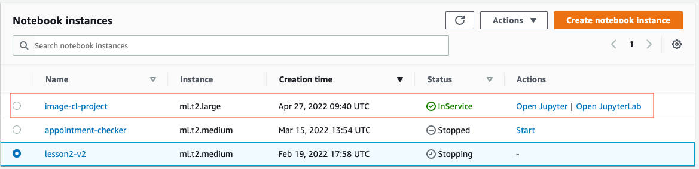
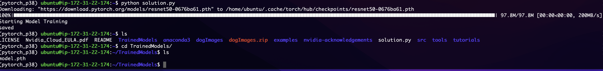

# Image Classification with SageMaker:

## Part1: Train and deploy the model in SageMaker notebook

The following image displays the SageMaker notebook instance I created for this project. Since we are using SageMaker SDK and will run all the training jobs and processes using ephemeral instances, I've selected an ml.t2.large with 2 CPUs and 8GB of RAM for this work. 

## Part2: Train model in EC2

The following image shows running the "python solution.py" scrip using the "pytorch_p38" environment. And in the last line, you can see the model artifact that is saved on the EC2 instance.

I used an "m5.4xlarge" instance with 16 CPUs and 64 GB of memory. I selected this instance so that the training can be done faster

## Part3: Lambda function

The following image shows that the Lambda function that contains the "lambdafunction.py" was tested successfully and received 200 status and the expected prediction values. For this function to run correctly, I did: 

1. updated the endpoint_name to reflect the endpoint name that was deployed during the provided section
2. Add additional policies to the role that was generated to run the Lambda function  "AmazonSageMakerFullAccess". 

